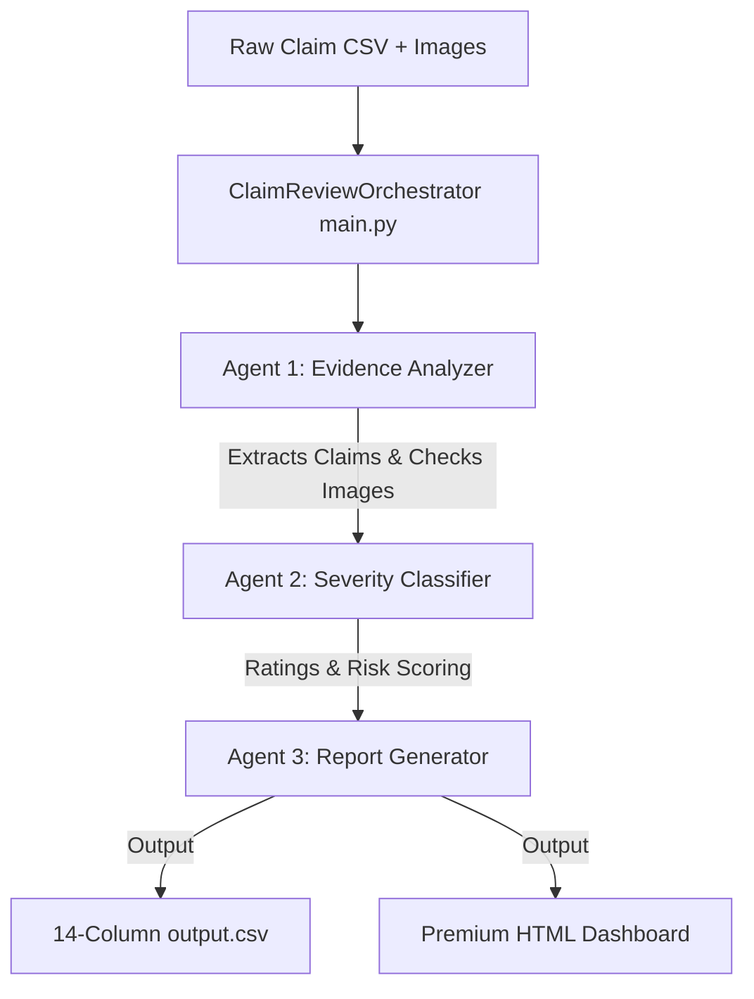

# Multi-Agent Claim Review System (Multimodal Evidence Review)
Target Track: **Agents for Business**

This system verifies visual damage claims using a class-based multi-agent system, Vision-Language Models (Google Gemini Vision), claims context, user history risk flags, and minimum image evidence requirements. It outputs both compliant flat prediction data and rich HTML summaries.

---

## 📊 Solution Architecture (ADK Pattern)

The system is split into three specialized agents coordinated by a central orchestrator:



1. **Evidence Analyzer Agent (`agents/evidence_analyzer.py`)**: Sanitizes the claim text, parses the object type, and queries Gemini Vision to determine if the visual evidence meets the standard required to evaluate the claim.
2. **Severity Classifier Agent (`agents/severity_classifier.py`)**: Compares claim claims with visible issues, merges user history risk profiles, determines the final decision status, and grades the visual severity.
3. **Report Generator Agent (`agents/report_generator.py`)**: Consolidates predictions into the exact 14-column CSV schema and compiles a premium, interactive HTML visual dashboard.

---

## 📁 Repository Structure

```text
code/
├── main.py                           # Main orchestrator (produces output.csv + report.html)
├── config.py                         # Centralized environment & settings configuration
├── requirements.txt                  # System dependencies
├── Dockerfile                        # Containerization setup
├── docker-compose.yml                # Docker compose orchestration
│
├── agents/                           # Core autonomous agents (ADK)
│   ├── __init__.py
│   ├── base_agent.py                 # Abstract Base Agent class
│   ├── evidence_analyzer.py          # Claim parsing & vision checker
│   ├── severity_classifier.py        # Damage classification & risk scoring
│   └── report_generator.py           # Outputs generation (CSV + HTML Dashboard)
│
├── tools/                            # System utilities & validation
│   ├── __init__.py
│   ├── gemini_tool.py                # Wrapper for Gemini Vision API with backoffs
│   ├── file_handler.py               # Wrapper for CSV, image loading, and parsing
│   └── validators.py                 # Pydantic validation schemas
│
├── server/                           # Model Context Protocol (MCP) Server
│   ├── __init__.py
│   └── mcp_server.py                 # FastMCP server exposing verification tools
│
├── tests/                            # Pytest testing suite (offline mocked)
│   ├── __init__.py
│   ├── conftest.py                   # Testing fixtures
│   ├── test_agents.py                # Unit tests (fallbacks, sanitizers)
│   └── test_orchestration.py         # End-to-end integration tests
│
└── evaluation/                       # Evaluation framework
    ├── main.py                       # Runs A/B evaluations on sample_claims.csv
    └── evaluation_report.md          # Strategy analysis report
```

---

## 🛠️ Installation & Setup

1. **Configure environment variable:**
   Ensure you have Python 3.10+ installed. Export your Gemini API Key:
   ```bash
   # Windows PowerShell
   $env:GEMINI_API_KEY="your_api_key_here"

   # macOS / Linux
   export GEMINI_API_KEY="your_api_key_here"
   ```

2. **Install requirements:**
   ```bash
   pip install -r code/requirements.txt
   ```

---

## 🚀 Execution Instructions

### 1. Run claims prediction pipeline
To process the real claims in `dataset/claims.csv` and generate the final predictions in `output.csv` at the repository root, run:
```bash
python code/main.py
```
*Note: The script includes an intentional 12.0s sleep delay between claims to remain safely under the free-tier 5 RPM limit.*

### 2. Run the offline test suite
To run the automated pytest suite using mocked offline Vision responses (no tokens consumed):
```bash
python -m pytest code/tests/ -v
```

### 3. Run the evaluation pipeline
To evaluate performance and compare strategies (with vs. without historical context) against labeled data:
```bash
python code/evaluation/main.py
```
This updates the metrics report at `code/evaluation/evaluation_report.md`.

---

## 🐳 Containerized Deployment (Docker)

To run the entire system inside a container (fully isolating dependencies):

1. **Build the container:**
   ```bash
   docker build -t claims-reviewer code/
   ```

2. **Run predictions using compose:**
   ```bash
   # Make sure GEMINI_API_KEY is exported in your shell
   docker-compose -f code/docker-compose.yml up
   ```
   *This automatically mounts the datasets and writes outputs to `code/outputs/` on your host machine.*

---

## 🔌 Model Context Protocol (MCP) Server

To expose the claims reviewer toolset to other AI clients (e.g., Cursor, Windsurf, or Claude Code):

1. **Run the MCP server locally:**
   ```bash
   python code/server/mcp_server.py
   ```

2. **Inspect tools using the MCP Inspector:**
   ```bash
   npx @modelcontextprotocol/inspector python code/server/mcp_server.py
   ```
   *Exposes `verify_claim`, `check_user_history`, and `get_evidence_requirements` tools.*

---

## 🛡️ Enterprise-Grade Safeguards

1. **Strict Type safety**: Enforced using Pydantic Literal type-clamping, eliminating LLM enums hallucinations.
2. **Text Sanitization**: Claims text is stripped of control characters and bound-checked to prevent prompt injections.
3. **Deterministic Fallbacks**: 
   * If images fail to load or parse, a safe fallback policy is triggered immediately.
   * If `evidence_standard_met` is `False`, the final claim status is programmatically forced to `not_enough_information`.
   * Visual fraud signals (`possible_manipulation`) force `valid_image = False` and override claims.
